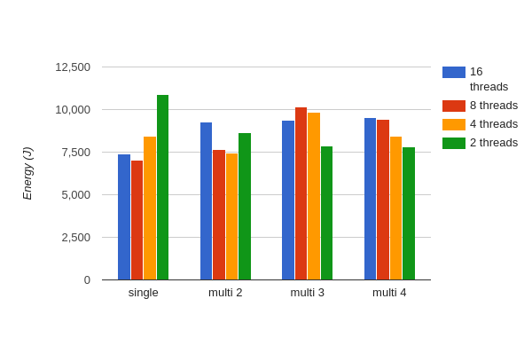

(194335736324 - 193983372358) / 60 / 1e6 = 5.87W
(194561169585 - 194335736324) / 60 / 1e6 = 3.76W
(194803751056 - 194561169585) / 60 / 1e6 = 4.04W
(195007676682 - 194803751056) / 60 / 1e6 = 3.40W
(195214955326 - 195007676682) / 60 / 1e6 = 3.45W

( 9415965763 -  9207238087) / 60 / 1e6 = 3.48W
( 9658588127 -  9415965763) / 60 / 1e6 = 4.04W
( 9873801566 -  9658588127) / 60 / 1e6 = 3.59W
(10071118321 -  9873801566) / 60 / 1e6 = 3.29W
(10284298073 - 10071118321) / 60 / 1e6 = 3.55W

(75326789951 - 75108601727) / 60 / 1e6 = 3.66W
(75532884882 - 75326789951) / 60 / 1e6 = 3.43W
(75736249962 - 75532884882) / 60 / 1e6 = 3.39W
(75925477688 - 75736249962) / 60 / 1e6 = 3.15W
(76170135936 - 75925477688) / 60 / 1e6 = 4.08W

idle: ~3.85W

1x16: ( 13414180808 -  11375215569) / 1e6 - (3.85 *  47.85) = 1854.742739J (* 4 =  7418.970956J)
1x8:  ( 15344565942 -  13414215537) / 1e6 - (3.85 *  44.60) = 1758.640405J (* 4 =  7034.561620J)
1x4:  ( 17793695781 -  15344599145) / 1e6 - (3.85 *  89.64) = 2103.982636J (* 4 =  8415.930544J)
1x2:  ( 21193148260 -  17793727702) / 1e6 - (3.85 * 177.30) = 2716.815558J (* 4 = 10867.262232J)

2x16: (209065697151 - 203966638793) / 1e6 - (3.85 * 123.00) = 4625.508358J (* 2 = 9251.016716J)
2x8:  (213280542196 - 209091397769) / 1e6 - (3.85 *  94.64) = 3824.780427J (* 2 = 7649.560854J)
2x4:  (217346531726 - 213280603597) / 1e6 - (3.85 *  89.84) = 3720.044129J (* 2 = 7440.088258J)
2x2:  (222346548284 - 217346561267) / 1e6 - (3.85 * 178.01) = 4314.648517J (* 2 = 8629.297034J)

3x16: ( 32600634132 -  24876569067) / 1e6 - (3.85 * 184.59) = 7013.393565J (* (4/3) =  9351.19142J)
3x8:  ( 40993326087 -  32608153156) / 1e6 - (3.85 * 197.88) = 7623.334931J (* (4/3) = 10164.44657J)
3x4:  ( 49111112190 -  40993369971) / 1e6 - (3.85 * 189.04) = 7389.938219J (* (4/3) =  9853.25095J)
3x2:  ( 55709603049 -  49131440568) / 1e6 - (3.85 * 179.96) = 5885.316481J (* (4/3) =  7847.08864J)

4x16: (232845813520 - 222368298533) / 1e6 - (3.85 * 239.91) = 9553.861487J
4x8:  (243172538670 - 232869701886) / 1e6 - (3.85 * 232.86) = 9406.325784J
4x4:  (252459338809 - 243252028884) / 1e6 - (3.85 * 199.63) = 8438.734425J
4x2:  (260976310231 - 252459881960) / 1e6 - (3.85 * 188.86) = 7789.317271J

